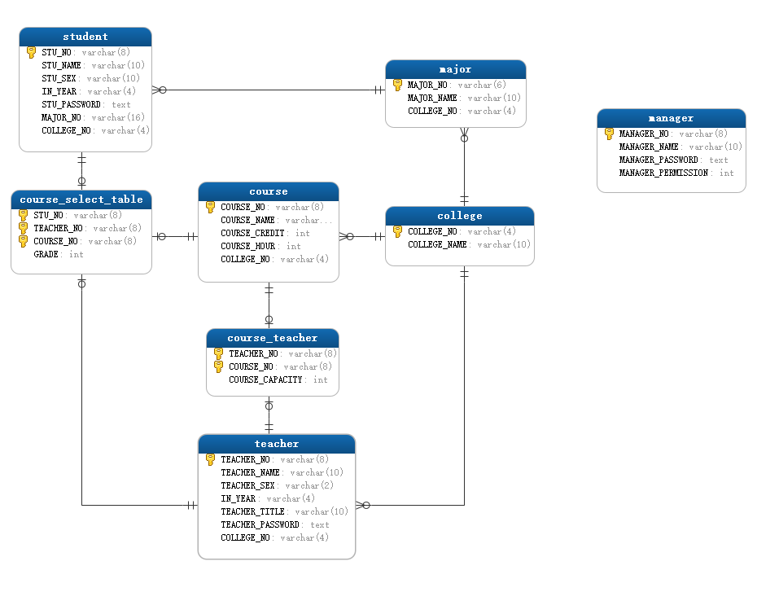
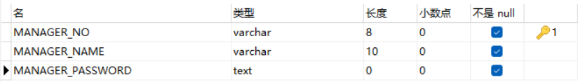
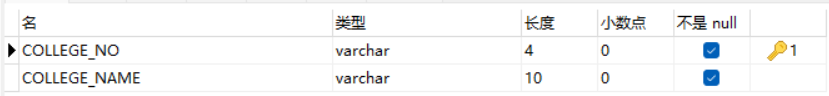
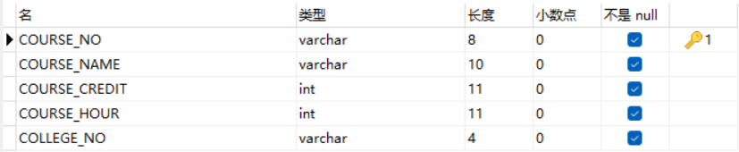
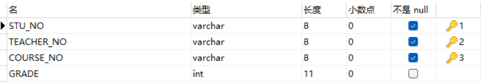
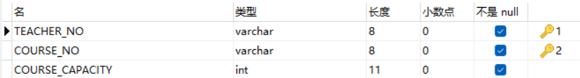
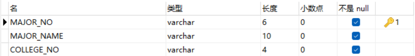
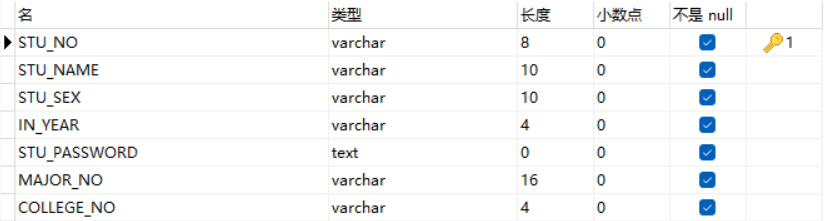
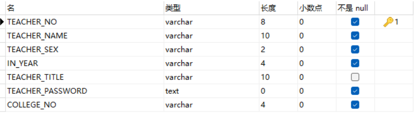

# 1、学生管理系统

> 可用来做毕设也可做课设。
>
> 更多源码可在个人网站查看：https://hpc.baicaitang.cn/

# 2、系统介绍

## 前端

- jquery
- css
- html
- bootstrap: 4.x

## 后端

- python: 3.6.x
- flask: 2.0.x

## 数据库

- mysql: 5.7

## 其他

- 数据库可视化工具：navicat
- 开发工具：vscode

# 3、各模块功能

## 学生管理模块

- 登录、退出
- 查看个人信息、修改个人信息
- 成绩查询
- 查看已选课程
- 选课、取消选课

- 搜索课程
- 课程列表分页功能

## 教师模块

- 登录、退出
- 查看个人信息、修改个人信息
- 录入学生成绩
- 导出学生成绩到excel
- 查看已开设课程、设置课程容量
- 添加开设课程、删除已开设课程

- 搜索学生、搜索课程

## 管理员模块

- 登录、退出
- 删除、添加学生和教师
- 取消学生已选课程，取消教师已开设课程
- 修改学生、教师信息
- 搜索学生和教师
- 修改学生或教师密码
- 修改已有学院信息，删除学院，添加学院
- 修改已有专业信息，删除专业，添加专业
- 修改已有课程信息，删除课程，添加课程

# 4、目录结构

```python
├─ app
│  ├─ forms.py
│  ├─ models.py				后端模型层，用于定义数据库模型和处理模块
│  ├─ static				前端静态文件目录
│  │  ├─ css				css文件
│  │  │  ├─ base.css				初始化样式
│  │  │  ├─ bootstrap-select.css				bootstrap-select插件文件
│  │  │  ├─ bootstrap-select.css.map			bootstrap-select插件文件
│  │  │  ├─ bootstrap.css				bootstrap文件
│  │  │  ├─ bootstrap.css.map			bootstrap文件
│  │  │  └─ style.css				页面样式文件
│  │  ├─ images				图片
│  │  │  └─ logo.webp			logo
│  │  └─ js				javascript文件
│  │     ├─ background.js				页面粒子插件配置
│  │     ├─ bootstrap-select.js				bootstrap-select插件文件
│  │     ├─ bootstrap.bundle.min.js				bootstrap文件
│  │     ├─ bootstrap.min.js			bootstrap文件
│  │     ├─ common.js				公共js
│  │     ├─ jquery.min.js				jquery.js
│  │     ├─ jquery.table2excel.min.js				导出文件插件
│  │     ├─ navbar.js			导航js
│  │     ├─ page.js				分页js
│  │     ├─ particles.js			页面粒子插件
│  │     └─ table.js			页面表单js
│  ├─ templates				前端页面模板
│  │  ├─ 400.html				400页面
│  │  ├─ 404.html				404页面
│  │  ├─ 500.html				500页面
│  │  ├─ add_edit_user.html				
│  │  ├─ add_score.html
│  │  ├─ add_teacher_course.html
│  │  ├─ base.html				
│  │  ├─ choose_course.html
│  │  ├─ course_setup.html
│  │  ├─ edit_password.html
│  │  ├─ index.html
│  │  ├─ isChoosed_course.html
│  │  ├─ login.html
│  │  ├─ managing_college.html
│  │  ├─ managing_course.html
│  │  ├─ managing_major.html
│  │  ├─ managing_users.html
│  │  ├─ personal_information.html
│  │  ├─ revise_info.html
│  │  └─ score_query.html
│  ├─ utils				存放功能函数
│  │  ├─ query.py
│  ├─ web				视图，用于处理http请求、处理modal、返回信息
│  │  ├─ manager.py			
│  │  ├─ student.py			
│  │  ├─ teacher.py			
│  │  ├─ views.py			
│  │  ├─ __init__.py
│  ├─ __init__.py
├─ config.py				配置文件
├─ error.py				错误处理
├─ main.py				入口函数
├─ requirement.txt				项目依赖
```

# 5、数据库设计

## E-R图




## manager

> 管理员表



```python
# 管理员
class Manager(UserMixin,db.Model):
    MANAGER_NO = db.Column(db.String(8),primary_key=True)
    MANAGER_NAME = db.Column(db.String(10),nullable=False)
    MANAGER_PASSWORD = db.Column(db.Text, nullable=False)

    def get_id(self):
        return self.MANAGER_NO
    
    def set_password(self, password):
        self.MANAGER_PERMISSION = generate_password_hash(password)

    def check_password(self, password):
        return check_password_hash(self.MANAGER_PASSWORD,password)
```


## college

> 学院表



```python
# 学院表
class College(db.Model):
    COLLEGE_NO = db.Column(db.String(4),primary_key=True)
    COLLEGE_NAME = db.Column(db.String(10),nullable=False)
    TEACHERS = db.relationship('Teacher',backref='college',lazy='subquery') # 学院：教师 = 1:n
    STUDENTS = db.relationship('Student',backref='college',lazy='subquery') # 学院：学生 = 1:n
    MAJORS = db.relationship('Major',backref='college',lazy='subquery') # 学院：专业 = 1:n
    COURSES = db.relationship('Course',backref='college',lazy='subquery') # 学院：课程 = 1:n
```


## course

> 课程表



```python
# 课程表
class Course(db.Model):
    COURSE_NO = db.Column(db.String(8), primary_key=True)
    COURSE_NAME = db.Column(db.String(10), nullable=False)
    COURSE_CREDIT = db.Column(db.Integer, nullable=False)
    COURSE_HOUR = db.Column(db.Integer, nullable=False)
    TEACHERS = db.relationship('Teacher', secondary='course_teacher', backref='course', lazy='subquery') # 教师：课程 = m:n
    COLLEGE_NO = db.Column(db.String(4), db.ForeignKey('college.COLLEGE_NO'), nullable=False)
```


## course_select_table

> 学生已选课表



```python
# 教师-学生-课程 m:n
class Course_select_table(db.Model):
    __tablename__ = 'course_select_table' # 设置表名, 表名默认为类名小写
    STU_NO = db.Column(db.String(8),db.ForeignKey('student.STU_NO'),primary_key=True,nullable=False)
    TEACHER_NO = db.Column(db.String(8),db.ForeignKey('teacher.TEACHER_NO'),primary_key=True,nullable=False)
    COURSE_NO = db.Column(db.String(8),db.ForeignKey('course.COURSE_NO'),primary_key=True,nullable=False)
    GRADE = db.Column(db.Integer)

    def __init__(self,STU_NO,TEACHER_NO,COURSE_NO):
        self.STU_NO = STU_NO
        self.TEACHER_NO = TEACHER_NO
        self.COURSE_NO = COURSE_NO
        
    # 录入成绩
    def input_grade(self,grade):
        self.GRADE = grade
```


## course_teacher

> 教师课程表



```python
# 课程-教师 m:n
class Course_Teacher(db.Model):
    __tablename__ = "course_teacher"
    TEACHER_NO = db.Column(db.String(8),db.ForeignKey('teacher.TEACHER_NO'),primary_key=True,nullable=False)
    COURSE_NO = db.Column(db.String(8),db.ForeignKey('course.COURSE_NO'),primary_key=True,nullable=False)
    COURSE_CAPACITY = db.Column(db.Integer,nullable=False)

    def __init__(self,TEACHER_NO,COURSE_NO,COURSE_CAPACITY):
        self.COURSE_NO = COURSE_NO
        self.TEACHER_NO = TEACHER_NO
        self.COURSE_CAPACITY = COURSE_CAPACITY
```


##  major

> 专业表



```python
# 专业表
class Major(db.Model):
    MAJOR_NO = db.Column(db.String(6),primary_key=True) 
    MAJOR_NAME = db.Column(db.String(10),nullable=False)
    COLLEGE_NO = db.Column(db.String(4),db.ForeignKey('college.COLLEGE_NO'),nullable=False) # 添加外键
    STUDENTS = db.relationship('Student',backref='major',lazy='subquery') # 专业：学生 = 1:n
```


##  student

> 学生表



```python
# 学生表
class Student(UserMixin,db.Model):
    STU_NO = db.Column(db.String(8),primary_key=True)
    STU_NAME = db.Column(db.String(10),nullable=False)
    STU_SEX = db.Column(db.String(10),nullable=False)
    IN_YEAR = db.Column(db.String(4),nullable=False)
    STU_PASSWORD = db.Column(db.Text, nullable=False)
    COLLEGE_NO = db.Column(db.String(4), db.ForeignKey('college.COLLEGE_NO'), nullable=False)
    COURSES = db.relationship('Course', secondary='course_select_table', backref='student', lazy='subquery') # 学生：课程 = m:n
    MAJOR_NO = db.Column(db.String(16), db.ForeignKey('major.MAJOR_NO'), nullable=False)

    def __init__(self,STU_NO,STU_NAME,STU_SEX,IN_YEAR,MAJOR_NO):
        self.STU_NO = STU_NO
        self.STU_NAME = STU_NAME
        self.STU_SEX = STU_SEX
        self.IN_YEAR = IN_YEAR
        self.MAJOR_NO = MAJOR_NO
        self.set_password('123456')
    
    def get_id(self):
        return self.STU_NO
    
    def set_password(self,password):
        self.STU_PASSWORD = generate_password_hash(password)

    def check_password(self,password):
        return check_password_hash(self.STU_PASSWORD,password)
     # 取消选课
    def drop_course(self,COURSE_NO):
        course_drop = [course for course in self.COURSES if course.COURSE_NO==COURSE_NO][0]
        self.COURSES.remove(course_drop)
```


## teacher

> 教师表



```python
# 教师表
class Teacher(UserMixin,db.Model):
    TEACHER_NO = db.Column(db.String(8), primary_key=True)
    TEACHER_NAME = db.Column(db.String(10), nullable=False)
    TEACHER_SEX = db.Column(db.String(2), nullable=False)
    IN_YEAR = db.Column(db.String(4), nullable=False)
    TEACHER_TITLE = db.Column(db.String(10))
    TEACHER_PASSWORD = db.Column(db.Text, nullable=False)
    COLLEGE_NO = db.Column(db.String(4), db.ForeignKey('college.COLLEGE_NO'), nullable=False)
    STUDENTS = db.relationship('Student', secondary='course_select_table', backref='teacher', lazy='subquery')
    COURSES = db.relationship('Course', secondary='course_teacher', backref='teacher', lazy='subquery')

    def __init__(self,TEACHER_NO,TEACHER_NAME,TEACHER_SEX,IN_YEAR,TEACHER_TITLE):
        self.TEACHER_NO = TEACHER_NO
        self.TEACHER_NAME = TEACHER_NAME
        self.TEACHER_SEX = TEACHER_SEX 
        self.IN_YEAR = IN_YEAR
        self.TEACHER_TITLE = TEACHER_TITLE
        self.set_password('123456')

    def get_id(self):
        return self.TEACHER_NO
    
    def set_password(self,password):
        self.TEACHER_PASSWORD = generate_password_hash(password)

    def check_password(self,password):
        return check_password_hash(self.TEACHER_PASSWORD,password)
```


# 6、项目运行环境

> 运行前需要先安装好python3.6.x和mysql5.7，数据库可视化工具navicat(或者其他工具)

## 1、安装mysql5.7

### 教程：[链接](https://zhuanlan.zhihu.com/p/603656622)

### 数据库可视化工具navicat安装包地址：  [链接](https://www.aliyundrive.com/s/ySC1prAKwNo)

### 安装数据库可视化工具navicat教程：[链接]( https://blog.csdn.net/weixin_43960383/article/details/121358265)

## 2、安装python3.6.x

### 教程 ：[链接](https://zhuanlan.zhihu.com/p/569019068)

###  查看是否安装成功

打开cmd，输入python ，点击回车，出现版本号则安装python成功

### 配置镜像源:

首先在电脑`C:\Users\Administrator`下新建一个pip文件夹，然后在pip文件夹下再新建`pip.ini`文件，`pip.ini`保存以下内容：

```
[global]
index-url = http://pypi.douban.com/simple/
[install]
trusted-host = pypi.douban.com
```

## 3、安装环境

### 安装virtualenv

打开cmd，输入命令：

```
pip install virtualenv
```

安装新的虚拟环境：

```
mkdir project		新建project文件夹
```

```
cd project		进入project文件夹
```

```
virtualenv venv		安装环境
```

**激活环境**：

```
venv\scripts\activate
```

### 查看第三方包

```
pip list
```

### 复制项目到project文件夹下，安装requirements.txt依赖

```
pip install -r requirement.txt
```

# 7、修改配置

## 新建数据库

打开navicat连接数据库，新建数据库，名称`student_management_system`或者自己取，字符集为utf8mb4，导入SQL的文件执行或者新建查询复制sql文件的内容到查询并执行

## 修改项目配置

首先修改config.py的配置，配置为自己的：

```python
HOST = '127.0.0.1'
PORT = '3306' #端口
DATABASE = 'student_management_system' #数据库名称
USERNAME = 'root'  # 连接用户名称
PASSWORD = '123456' #密码
```

入口函数main.py修改端口：

```python
from app import app

if __name__ == "__main__":
    app.run(host='127.0.0.1', port=1208, debug=True)
```

# 8、数据库迁移

安装完上面的依赖后，执行：

##  生成迁移文件夹  只执行一次

```
flask db init  
```

## ⽣成迁移版本, 保存到迁移文件夹中

```
flask db migrate  
```

## 执行迁移

```
flask db upgrade 
```

#  9、运行

选择**Enter interpreter path**载入，本地的虚拟环境路径或者直接选择，VS Code从本地读取到的虚拟环境（刚才安装的`venv\scripts\activate`）

**运行：**

```
python main.py
```

# 10、登录

## 测试账号：

## 学生

- 账号：20231001
- 密码：123

## 教师

- 账号：30000001
- 密码：123456

## 管理员

- 账号：12345678
- 密码：admin
